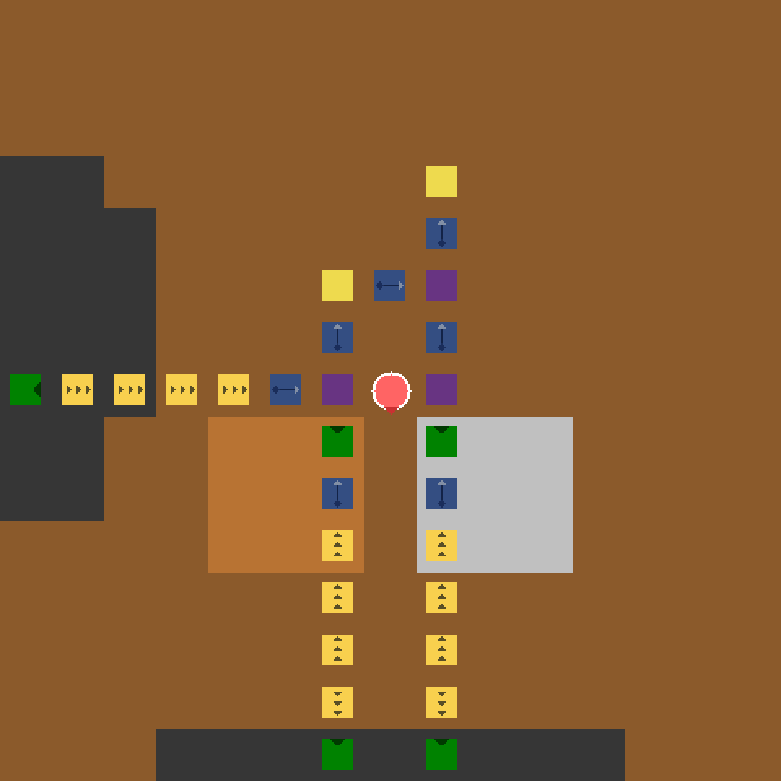
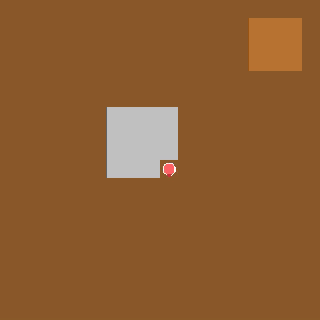
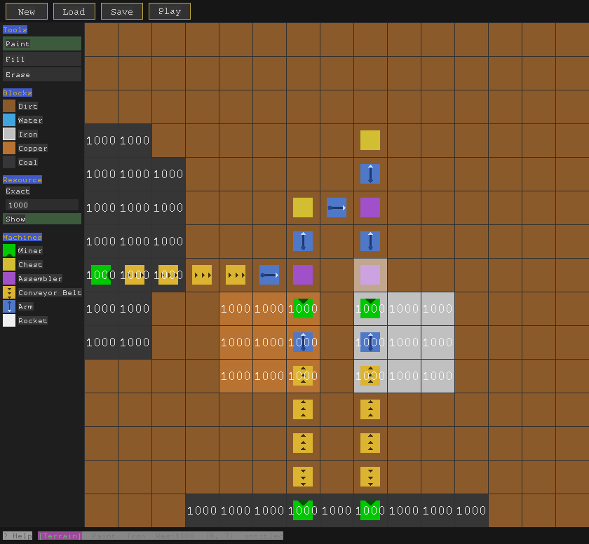

# FactoriaX

A Factorio-inspired RL environment built on JAX. Mine ore, craft machines, automate your factory, launch a rocket.

<p align="center">
  
</p>

## What is this?

FactoriaX is a grid-world environment where agents learn to build factories from scratch. You start on a map with nothing but ore in the ground. Mine it by hand, craft it into machines, and place those machines to automate the process. The goal is to produce enough components to build and place a rocket.

The interesting part is the progression. Early on, you're manually walking to ore patches and mining one block at a time. Then you build your first miner, and it starts pulling ore automatically, but it needs coal for fuel, so now you need logistics. You build conveyor belts to move items, arms to transfer between machines, chests to buffer, and assemblers to combine materials into rocket parts. Each machine you build costs resources that don't come back, so every decision about what to build and where matters.

The whole thing runs on GPU through JAX. Every piece of game state is an immutable JAX array, the step function is fully JIT-compiled, and you can `vmap` across dozens of parallel environments. That means you can run training at the speed of your GPU rather than waiting on Python loops.

<p align="center">
  
</p>

## Quick start

```bash
# Install
git clone <repo-url> && cd factoriax
uv sync

# Play it yourself
python -m factoriax.play.main

# Train a PPO agent
python baselines/single_agent_ppo.py --num-envs 64 --total-steps 10_000_000
```

## How the game works

You have 13 actions: move in four directions, mine the block you're facing, craft a recipe, place a machine, pick up a machine, and cycle through your inventory slots and recipes.

Resources on the map are finite. Once you mine an ore tile down to zero, it turns to dirt permanently. This is what makes the problem hard for agents: there's no undo, and wasting materials early can make late-game goals impossible.

**Crafting recipes:**

| Recipe | Ingredients | Time |
|--------|------------|------|
| Miner | 5 copper, 5 iron | 3 ticks |
| Chest | 5 iron | 2 ticks |
| Conveyor Belt | 1 iron | 1 tick |
| Arm | 5 iron, 1 copper | 5 ticks |
| Assembler | 10 iron, 5 copper | 5 ticks |

Once you have an assembler placed, it can produce the rocket components:

| Recipe | Ingredients | Time |
|--------|------------|------|
| Hull | 5 iron | 4 ticks |
| Fuel Pack | 3 copper, 2 coal | 6 ticks |
| Rocket | 50 hulls, 20 fuel packs | 100 ticks |

Place the rocket on the map and you win.

## For researchers

FactoriaX implements the [gymnax](https://github.com/RobertTLange/gymnax) interface:

```python
from factoriax.envs import make_factoriax_env
from factoriax.levels import get_level

env, params = make_factoriax_env()
level = get_level("15x15_resources")
obs, state = env.reset_from_level(level, params)
obs, state, reward, done, info = env.step_env(key, state, action, params)
```

**Observations.** The environment supports both full and partial observability. Global observations give the agent a complete view of the map, while local observations provide a windowed patch centered on the agent, which is closer to how a real player would experience the game.

**Multi-agent support.** Set `num_players` in `EnvParams` and multiple agents share the same map, competing for finite resources under partial observability.

**Benchmarks.** A set of benchmark levels ship with the environment, each designed to isolate a specific challenge like navigation, resource prioritization, or multi-resource coordination. You can also build your own benchmarks using the level editor or the programmatic `LevelBuilder` API, then load them directly into the environment.

<p align="center">
  
</p>

**Rewards and costs.** Reward functions are included out of the box, from sparse achievement-based signals to dense proximity rewards. The environment also exposes cost functions for safe RL research, where agents must balance resource consumption against irreversible depletion.

**Achievements.** 17 milestones span the full game, from mining your first ore to launching the rocket. They provide a sparse signal that can guide agents through the progression without hand-engineering dense rewards, and serve as a natural frame of reference for how far along an agent is toward completing the game.

**Analysis tools.** Record trajectories, export GIFs, plot action distributions, track achievement timing, and measure multi-agent role divergence.
