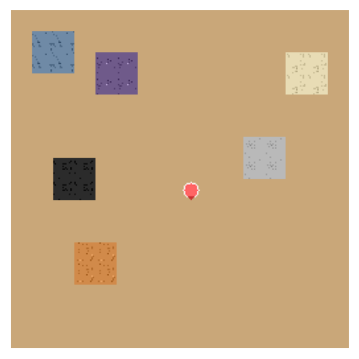

# Factoriax

A grid world for reinforcement learning research, in the style of Factorio,
written in JAX.

The state is a set of JAX arrays. `step` and `reset` compile to one XLA graph,
so `jax.vmap` runs a batch of environments on the GPU, with no Python in the
inner loop.

<p align="center">
  
</p>

## Install

```bash
uv sync
```

## Run the playground

The playground is the human interface. It holds the game and the level editor.

```bash
uv run python -m factoriax.playground
```

The launcher opens with three entries: Play, Editor, and Settings.

## Build an environment

```python
import jax

from factoriax.make import env_from_name

env, params = env_from_name("EasyRocket-v1")
obs, state = env.reset_env(jax.random.PRNGKey(0), params)
```

Five scenarios carry an id: `Mining-v1`, `MinerBootstrap-v1`,
`ScienceTiers-v1`, `EasyRocket-v1`, and `Rocket-v1`.
`factoriax.engine.envs.registry.list_scenarios` returns each id with its spec.

## Action design

The action set follows three rules.

**One action, one outcome.** A player crafts a miner with the single action
`CRAFT_MINER`. It does not cycle through a recipe list and then press a craft
key. The action space holds 87 actions, and no action hides a sequence.

**The observation tells the agent what works.** An affordability bit for each
item says whether the player can craft that item now. The agent therefore
reads what an action does before it takes that action. The bit belongs to an
item, and not to a recipe.

**Context does not change an action.** A craft takes items from the inventory
and adds the result. A mine adds an item, and a place takes one. There is no
separate crafting mode that changes what a key does.

## Test and lint

```bash
uv run pytest
uv run ruff check factoriax tests
```

### Where a test goes

`tests/` mirrors the package. The path `tests/<area>/test_<module>.py` maps to
`factoriax/<area>/<module>.py`, so the tests for `engine/machines.py` are the
only thing that can sit at `tests/engine/machines/`.

A mirror entry is a file or a package. Write `test_<module>.py` first. When it
passes about 600 lines, turn it into a `<module>/` package of topic-named
files. `engine/machines.py` carries 2600 lines of tests, so its entry is a
package split by machine kind.

Three directories sit beside the mirror, for the tests that belong to no one
module:

- `tests/contracts/` holds a test that asserts a rule no single module owns.
  The gymnax API conformance, the invariants over random episodes, and the AST
  guard that stops the play UI writing `EnvState` all live here.
- `tests/integration/` holds a test that needs two or more subpackages to have
  meaning. The editor-to-level-to-engine round trip is one.
  `tests/integration/scenarios/` holds the end-to-end scripted rollouts.
- `tests/benchmarks/` holds scripts. Pytest does not collect it.

Put a test in the mirror unless it cannot go there. A file in `contracts/` or
`integration/` states in its module docstring why it is not in the mirror.

`tests/helpers/` holds support code that more than one directory shares: the
state factory, the trajectory builders, the observation scaffolding, and the
scripted-oracle navigation. A helper that one file uses belongs beside that
file.

### Two things that bite

Only `tests/playground/` initialises a pygame display, through an autouse
fixture. A test elsewhere that renders must request `pygame_display` by name.
A file that does not will pass in a full run and fail on its own, because an
earlier directory left a display behind.

`tasks/coverage-gaps.md` lists every module with no mirror entry, and says
whether that is a gap, covered through another module, or waived.

## Build the documentation

```bash
cd docs && make html
```

The build writes the pages to `docs/_build/html`.

The build does not run the notebooks. `nb_execution_mode` is `"off"`, and the
`html` target removes the stored output first. A guide page therefore holds
the source of each cell, and the figures that `docs/guides/_images` holds. To
make a new figure, run the notebook yourself and commit the file that it
writes.

## Where to read next

- [`docs/guides/getting_started.ipynb`](docs/guides/getting_started.ipynb):
  the environment, the observation, the action space, and a random rollout.
- [`docs/guides/ppo_training_example.ipynb`](docs/guides/ppo_training_example.ipynb):
  train a PPO agent on a Factoriax task.
- [`docs/api/index.rst`](docs/api/index.rst): the reference for every public
  module. Sphinx builds it from the docstrings.
- [`ISSUES.md`](ISSUES.md): the known defects that stay open.
